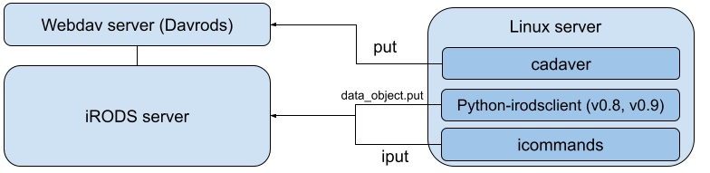
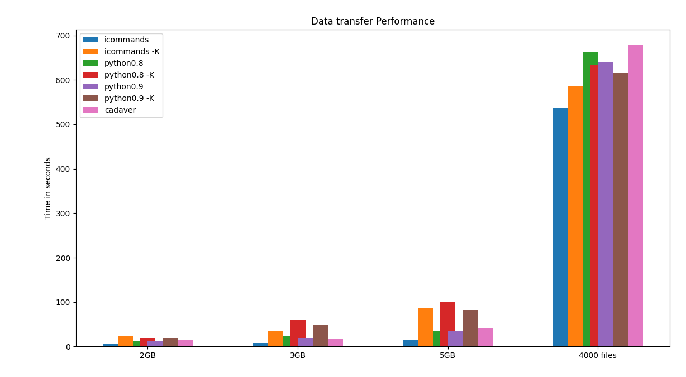

# Data transfer performance tests

The speed of data transfers is depending on two factors 1) the network capacity and 2) the efficiency of the data transfer protocol.

In this experiment we tested how quickly we can ingest data into an iRODS server. To exclude any bias introduced by network capacity we transferred data between two linux servers in our local data centre. 

We tested several clients to ingest data into iRODS from another linux server. The performance of the webdav endpoint we tested with the client softwre `cadaver`. Th native iRODS data transfers were tested through the python iRPDS API version 0.8 and 0.9; and the *icommands*. 

The figure above describes the server setup for the performance tests with the webdav protocol and the native iRODS client `icommands`. 

We compared the speed of the put command of cadaver with those of the iRODS python API and the icommands. The iRODS icommands and python API allow to directly calculate and compare checksums between the source and the destination (indicated by the flag `-K`). The checksum calculation of larger files or many files will also impact the overall transfer time.

The figure below shows the results.

When single larger files are transferred, the transfer time between the webdav protocol, python iRODS API and the iRODS native data transfer protocol are nearly identical. Calculating checksums on both sides, source and destination, takes most of the time when files are larger than 1GB.

We also transferred 4000 small files of 500KB. Here one can see that the calculation of checksums impacts the overall performance less than compared with large single files. However, when transferring many files at once the webdav protocol and the python API are much less efficient than the `icommands`.  